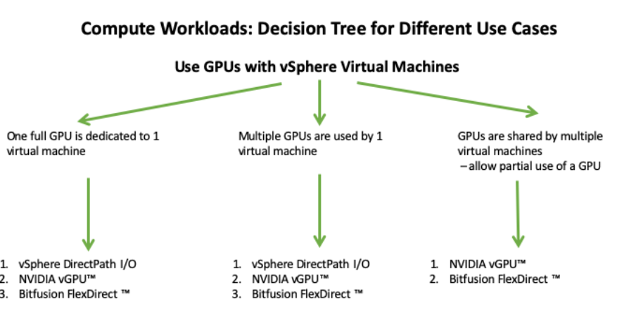
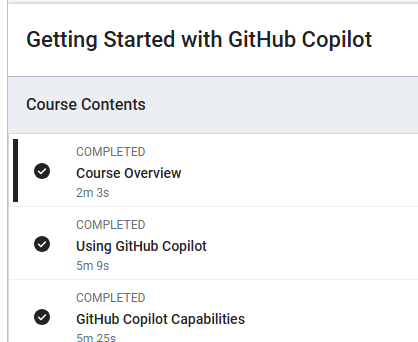

# Shopping List

then hit Ctrl + K and then v

## Items

1. List
2. Big Mouse
3. SSD

## To add an image

drag it and hold the  Shift key  and drop it to the location you want



## ## you can also copy and paste an image from snipping Tool



## Adding java code

place 3 ticks and close with another 3 ticks where the code ends like below

```js
var increment = function (num) {
    return num++
};

console.log(Increment(5));

```

## python code

```py
print("Hello world")
```

## Dealing with multiple pages

- you may need to navigate from one page to another.
- add description of your link within [xxx!](destination of the pageto point ot another file called readme.md)

[Link to more info in this readme.md!](readme.md)

## Intitialize git repository from VS code

- Right -click on Folder> Open in Integrated Terminal and enter
  - 'git init'   # to initialize repospository
  - git add .  # add all the files that will be track Git
  - git commit -am "initial commit"  # push to Github
  - git remote add origin https://github.com/PeterTah/VCF_Notes.git  # push to remote GitHub, origin is our remote URL
  - git push origin master  # push to succesfully to Github

# Check your current branch name:

    - git branch

# Rename your branch from main to vxrail

    git branch -m master
    git push origin master
    git push --set-upstream origin vxrail

# Verify you’ve committed something

    - git status

# to add and commit files

    - git add .
    - git commit -m "Initial commit"
    - git push origin vxrail  # or master, depending on your branch
